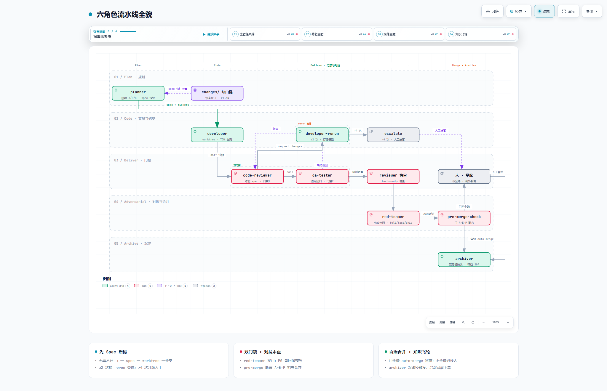
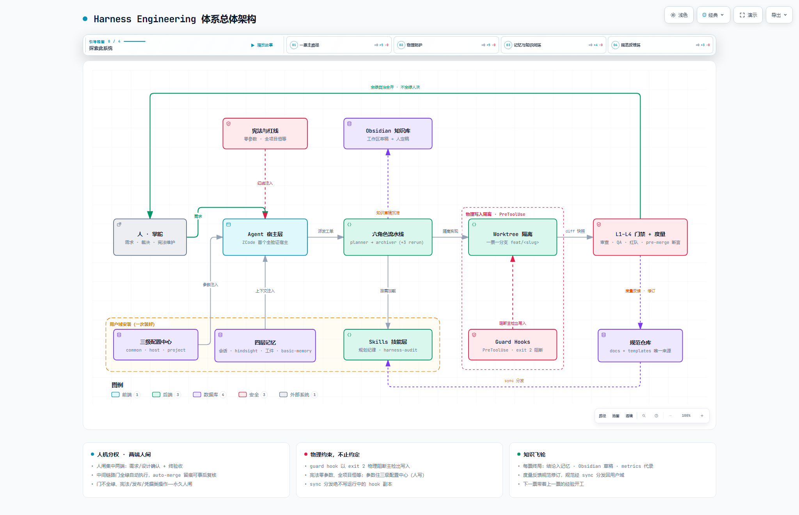

# Harness Engineering

English | [中文](README.zh.md)

**Agent = Model + Harness.** Models churn every quarter; your engineering standards shouldn't. Harness Engineering turns "good code" from a property of the model into a property of the *system* — a versioned, measurable, self-improving harness around any AI coding agent.

This repository is a **battle-tested, host-agnostic harness specification + installer toolkit**: a six-role agent pipeline (planner → developer → code-reviewer → qa-tester → red-teamer → archiver), physical write-isolation guardrails, three-layer memory (basic-memory / hindsight / Obsidian), an executable audit spec, and a three-phase installer (detect → install → adapt) that can be driven end-to-end by an AI agent with a human only for elevation, GUI installs, credentials, and decisions.

> **Core philosophy: humans steer, agents execute.**

> Validated in a real pilot project: 6 tickets end-to-end, 0 implementation defects found in QA, adversarial red-team hits with zero overlap vs. review+QA, independent harness audit baseline 93/100 (A).

---

## Why Harness Engineering?

AI coding works great for an individual — and breaks the moment a team (or a second machine, or a next quarter) gets involved:

- Everyone maintains their own prompts and project rules; nothing is inherited, nothing is auditable. When a person leaves, their "AI experience" leaves with them.
- Quality is whatever the model happens to produce that day. Model upgrades silently change behavior; there is no gate that says *this* is done.
- The same trap repeats: chat transcripts become the documentation, "looks right" becomes the review, and the loudest prompt wins.

Harness Engineering's answer (echoing OpenAI's agent-first field report — see [References](#references)): treat the AI as an **engineering unit that can be constrained by rules and improved by measurement**. Wrap it in a harness you own:

- the model is uncontrollable — the harness is controllable;
- rules, skills and tool access live in a **versioned repo**, not in someone's chat window;
- every change flows Spec → Code → Review → QA → Adversarial check → **human merge** → Archive, with evidence on disk.

## What is Harness Engineering?

The harness is the engineering layer between an LLM and productive, governable coding work. Six pillars:

| Pillar | What it governs here |
|---|---|
| Context | Index-style constitution (AGENTS.md ≤100 lines), spec-first docs tree (`specs/tickets/reviews/changes`) |
| Tools | Three-layer capability stack: Rules → Skills → MCP; per-role tool allowlists (reviewer read-only, planner no-Write) |
| Orchestration | Six-role pipeline with model routing and rerun variants for repair rounds |
| Memory | Team memory (basic-memory, git-tracked) · individual memory (hindsight) · human knowledge base (Obsidian) |
| Evaluation | L1–L4 quality gates, metrics ledger, `harness-audit` 7-dimension executable spec |
| Guardrails | Physical write-isolation hooks, main-branch direct-commit whitelist, human-only constitution |

Work flows through **Plan → Code → Deliver → Archive (+ knowledge retention)** — the "+1" Archive phase is where process assets become searchable team knowledge.

## How to do it

The pipeline — six roles, one ticket, from spec to archive (full detail in [`docs/02`](docs/02-team-core.md)):

[](https://pages.20081005.xyz/pipeline.html)

**See it move**: the animated diagram is [live-hosted here](https://pages.20081005.xyz/pipeline.html) — click the image above to open the interactive version in your browser: it plays a Live trace of one ticket's journey through all six roles, with Light/Dark toggle, pan/zoom, search, and guided chapters. The same self-contained files also ship in this repo under [`docs/diagrams/`](docs/diagrams/) — clone and open locally if you prefer.

Core disciplines:

1. **Spec before code.** No ticket, no worktree. Spec gaps flow through a three-stage `changes/` chain and are folded back by the planner (r1→rN).
2. **Physical isolation.** Developer work happens in one worktree per ticket; a PreToolUse hook blocks writes to the main checkout outside whitelisted doc paths (`exit 2`). The constitution (AGENTS.md) is human-only by design.
3. **Adversarial gate.** Before merge, a red-teamer attacks what review+QA both missed (boundaries, concurrency, data, failure cascades, hidden assumptions, security, performance), graded full/fast/skip per ticket.
4. **Repair routing.** From attempt ≥2, rerun variants dispatch with a stronger pinned model; >4 attempts escalate to a human.
5. **Archive as a first-class phase.** Every ticket ends with consolidated memory, an Obsidian knowledge draft, metrics (including ±lines), and branch cleanup — the knowledge flywheel that feeds the next ticket.

### Getting started

**One sentence, full install.** Open an AI coding agent session (ZCode, Claude Code, Kimi Code — any host with file and terminal access) in any directory, and paste:

```text
Install Harness Engineering for me: clone https://github.com/wwplay1978/Harness-Engineering.git into the standard user-domain location ~/.agents/Harness-Engineering (create the directory if needed; on Windows expand to %USERPROFILE%\.agents\Harness-Engineering — the spec repo is maintained as a single copy shared by all AI agents on this machine; if git is missing, install git first, or download and extract the ZIP via the GitHub page's Code → Download ZIP button into that location instead), then ask me for the target project path (I will answer with the project's absolute path, or "none yet — install global components only"), and formally start the installation from S0, strictly following the kickoff prompt in docs/17-agent-assisted-install.md inside the cloned repo (§3; REPO = ~/.agents/Harness-Engineering, target project = my answer). Division of labor and safety rules are governed by that document.
```

The agent clones this repo into the standard user-domain location `~/.agents/Harness-Engineering` (one copy shared by all AI agents on the machine, alongside `~/.agents/skills`), asks for your target project, then drives the whole install ([`docs/17`](docs/17-agent-assisted-install.md)) — including rendering the project constitution AGENTS.md from a short Q&A with sensible defaults; you only handle elevation / GUI / credentials / decisions.

**Agent-driven install, step by step**: do the 10–20 min human prep ([`docs/17 §2.5`](docs/17-agent-assisted-install.md) — optionally pre-install basics, get credentials; the repo clone itself is agent-runnable into the standard location), then paste the full kickoff prompt ([`docs/17 §3`](docs/17-agent-assisted-install.md)) in any directory — zero placeholders since 2026-09-08 (REPO defaults to the standard location; the target project is asked at kickoff).

**Manual path**: environment probe → parameterized installers → adaptation, per [`docs/16`](docs/16-host-agnostic-installer.md) and [`docs/07`](docs/07-migration-playbook.md):

```bash
git clone https://github.com/wwplay1978/Harness-Engineering.git ~/.agents/Harness-Engineering
node templates/installer/check-env.mjs          # read-only probe: profile + adaptation plan
templates/installer/install-hindsight-service.cmd --rehearse   # dry-run before any real install
```

## Architecture & design highlights

[](https://pages.20081005.xyz/architecture.html)

Interactive version: [live-hosted here](https://pages.20081005.xyz/architecture.html) — the human contract, host layer, six-role pipeline, physical write isolation, four-layer memory, and the spec feedback loop, with theme toggle, focus/search, and guided chapters.

```
Harness-Engineering/
├── docs/        reusable spec layer (concepts, six roles, memory, eval, guardrails,
│                migration playbook, toolchain portability, host-agnostic installer,
│                agent-assisted install) — docs/06/08–14 are internal engineering
│                archives and intentionally not published
├── templates/
│   ├── agents/            6 role files (+3 rerun variants generated by tooling)
│   ├── hooks/             guard / inject-memory / report-worktrees (payload-dual-read)
│   ├── installer/         check-env probe · parameterized NSSM service installer
│   │                      (v5, --rehearse) · pg0 junction fix (v3)
│   ├── tools/             sync-harness distributor · role-variant generator
│   ├── skills/            harness-audit executable spec
│   ├── AGENTS-template.md constitution skeleton (incl. commit whitelist)
│   ├── models.config.json per-role model routing table
│   └── *.json             user-level hooks template · project MCP template
```

Design decisions worth stealing:

- **Host-agnostic by contract.** The governance core is conventions + artifacts (constitution, role discipline, docs tree, git flow) — any agent host providing dispatch, subagents, blocking hooks, MCP and skills can carry it. ZCode is the first fully validated adapter; mainstream hosts — Claude Code, Kimi Code, Codex, OpenCode, Pi Agent — follow a documented 4-step adaptation discipline ([`docs/16 §2`](docs/16-host-agnostic-installer.md)). Ready-to-use adapter packages for all five ship in [`templates/adapters/`](templates/adapters/) ([`docs/18`](docs/18-host-adapters.md)); on-machine installation checks remain the first-install step.
- **Single source of truth + one-command distribution.** `templates/` is canonical; `sync-harness.mjs --apply` deploys to the user domain and reports drift (it deliberately *never* writes the executed hook copies — an AI must not be able to swap the running guard).
- **Graceful degradation.** Every component is optional with a documented workflow adaptation: full / core-plus / minimal profiles; the probe classifies your machine and emits an `adaptation-plan.md`.
- **Security rails baked in.** API keys never touch disk or agent transcripts; elevated scripts require a `--rehearse` dry-run first; hooks registration stays permanently human-hands; the constitution (AGENTS.md) is agent-rendered exactly once at install via a Q&A with defaults (human reviews the rendered file before it is committed) and human-only afterwards; installer outputs auto-redirect out of git work trees.
- **Ops-hardened on Windows.** ASCII-only batch files (ANSI codepage quirk), `chcp 65001` for non-ASCII usernames, UTF-8 service env (GBK crash lesson), process-name-whitelist kills, model `config.json` sentinels.

## How this compares

Several strong frameworks already live in the "agent harness / spec-driven development" space. Facts below come from each project's official README/docs and the GitHub API, checked 2026-09; star counts are approximate. "—" means "not documented in that project's README/docs as of the check".

| | This repo | [spec-kit](https://github.com/github/spec-kit) | [BMAD-METHOD](https://github.com/bmad-code-org/BMAD-METHOD) | [GSD](https://github.com/open-gsd/gsd-core) | [SuperClaude](https://github.com/SuperClaude-Org/SuperClaude_Framework) | [Task Master](https://github.com/eyaltoledano/claude-task-master) |
|---|---|---|---|---|---|---|
| Positioning | harness spec + installer toolkit | spec-driven development toolkit | agentic agile framework | lightweight spec-driven system | Claude Code enhancement | AI task management |
| Host scope | host-agnostic; 5 adapter packages; ZCode fully validated | 30+ agents | skills-based, multi-host | multi-runtime (9+ hosts) | Claude Code only (+ sibling ports) | MCP + CLI, many IDEs |
| Enforcement | **physical**: blocking hooks (`exit 2`), human-only constitution | prompt-only | prompt-only | prompt-only | prompt-only | — |
| Adversarial gate | **red-teamer**, 7 attack surfaces, full/fast/skip per ticket | — | — | — | — | — |
| Archive phase | **archiver role**, 7-step SOP, knowledge flywheel | — | retros (separate module) | partial (ship phase) | — | — |
| Memory | 3 layers: basic-memory · hindsight · Obsidian | — | artifact-based durable context | STATE.md / CONTEXT.md files | built-in multi-layer | — |
| Audit & metrics | 100-point executable audit + per-ticket metrics ledger | — | — | — | — | complexity report only |
| ≈ stars | young | ~134k | ~53k | ~9k (legacy repo ~65k) | ~24k | ~28k (slowing since 2026-04) |

Where others genuinely win — stated plainly:

- **Community & adoption.** spec-kit and BMAD have orders of magnitude more users and cross-team battle-testing. This repo's evidence is one real pilot (6 tickets, 0 implementation defects in QA) plus an independent 93/100 audit baseline.
- **Onboarding ergonomics.** An `npx`-style installer and polished CLI beat a spec + templates repo that assumes install discipline. Our one-sentence agent-assisted install helps, but the entry cost is real.
- **Host verification.** Only ZCode is fully on-machine verified today; the other four adapters ship as ready packages with on-machine checks deliberately left as the first install step.
- **Platform breadth.** Ops hardening is Windows-first (NSSM, codepage, service lessons); Unix equivalents are less exercised.
- **Language.** Full docs are Chinese; this English README is a curated mirror, not a complete translation.

Choose by need: planning discipline with a huge community → spec-kit; a full agile process → BMAD; Claude Code superpowers → SuperClaude; task graphs → Task Master. What this repo adds on top: **physical (not advisory) enforcement**, an **adversarial gate before merge**, archive as a first-class **knowledge flywheel**, and a **measurable audit loop** — host-agnostic by contract.

## Measurement & continuous improvement

- **Metrics ledger per ticket** (`docs/04`): attempts, review rounds, QA rounds, QA defects, first-pass rate, test count, ±lines — recorded by the archiver, reviewed on a rolling cadence.
- **`harness-audit`**: an executable 7-dimension, 100-point audit spec (constitution quality, rules & enforcement, skills layering, tools, SDD process, engineering gates, memory & archive) producing S/A/B/C/D with P0–P3 remediation — quarterly, plus after major spec changes. Pilot baseline: 93/A.
- **Quality gates that actually bite**: first-pass ≠ 100% in early tickets is *healthy* — it means reviewer/QA gates catch real issues; severity trends should decay over time (P1 → P2/P3 in the pilot).
- **Feedback loops**: spec-gap `changes/` chain (same-day upgrades), audit findings back-fed into specs, adversarial-review overlap-rate tracking (pilot: red-team hits had zero overlap with review+QA).
- **Knowledge flywheel**: ticket → workspace draft (instantly searchable via vault→bank reconcile) → human curation into the final zone → next ticket's recall. Three layers closed-loop.

## References

- [Harness Engineering: Leveraging Codex in an Agent-First World](https://openai.com/index/harness-engineering/) (OpenAI) — the agent-first field report: a five-month experiment where humans worked as harness engineers and the agent wrote the code
- [hindsight (vectorize.io)](https://github.com/vectorize-io/hindsight) · [basic-memory](https://github.com/basicmachines-co/basic-memory) · [git-worktree-runner](https://github.com/coderabbitai/git-worktree-runner) — key open-source components

## License

[MIT](LICENSE)
